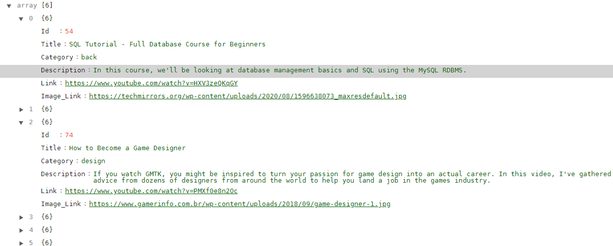
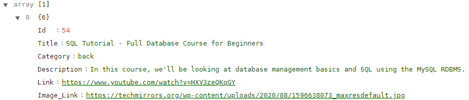
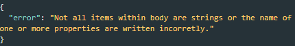
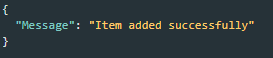
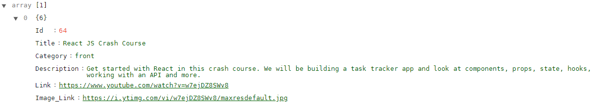
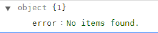

## APInsights - API for Infojr Insights website.

### What does it do ?

APInsights can be used for getting links and its image and description about content within the internet and categorized inside the API.

### How to run it locally ?

1. You will need git, mariadb, npm and node.js to run it.
2. Clone this repository using git and go to the folder

```git
git clone https://github.com/LucasDSL/APInsights.git apinsights
cd apinsights
```

3. On this directory, create a ".env" file for the mariadb credentials and fill it like below

```txt
HOST=<host_name>
PORT=<port_number>
USER=<user_name>
PASSWORD=<passowrd>
DATABASE=<databse_name>
```

obs: change everything for its name without the "<>"

4. Install all dependencies using npm:

```txt
npm install
```

5. All done! Run it!

```txt
npm run dev
```

Now even if you change the code, the nodemon will restart the server for you.\
And you can make request following the documentation below!

## Documentation

### General Purpose Routes

```txt
GET https://apinsights.herokuapp.com/insight
```

Return all items within database, not organized by category but by id, on a increasing order.


```txt
GET https://apinsights.herokuapp.com/insight/54
```
Return an array with one item with the requested id:


```txt
POST https://apinsights.herokuapp.com/insight
```

Allow the user to add a new item to the database. \
You'll need to use the following body format at the request. \
The category field can either be: "mix", "front", "back", "design", "mobile". It's important to use one of there since it will be determinant when searching for an item without using the general route /insight.

```JSON
{
	"Title": "SQL Tutorial - Full Database Course for Beginners",
	"Category": "back",
	"Link": "https://www.youtube.com/watch?v=HXV3zeQKqGY",
	"Image_Link": "https://techmirrors.org/wp-content/uploads/2020/08/1596638073_maxresdefault.jpg",
	"Description": "In this course, we’ll be looking at database management basics and SQL using the MySQL RDBMS. The course is designed for beginners to SQL and database management systems, and will introduce common database management topics. Throughout the course we’ll be looking at various topics including schema design, basic C.R.U.D operations, aggregation, nested queries, joins, keys and much more."
}
```

Make sure to write the fields within json correctly, otherwise you might get this error: \


If everything is correct you'll receive this message: \

### General Use of All Other Routes

```txt
GET https://apinsights.herokuapp.com/insight/:field/:id?
```

`field` : Mandatory. Can be either "back-end", "front-end", "design", "mobile" or "mix". \
`id`: Not Mandatory but if you use you'll be searching for an specific item within that field and with the specified id.
\
For instance if we

```txt
GET https://apinsights.herokuapp.com/insight/front-end/64
```

we recive in return:
 \
And if there is no item within field or with that id, we get: \

