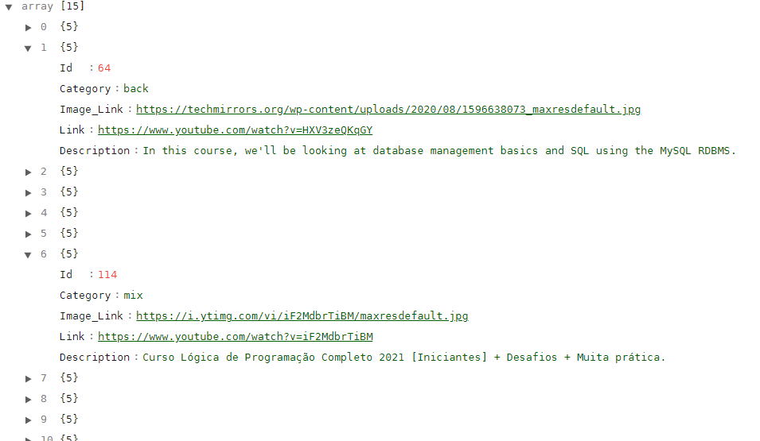

## APInsights - API for Infojr Insights website.

### What does it do ?

APInsights can be used for getting links and its image and description about content within the internet and categorized inside the API.

### How to run it locally ?

1. You will need git, npm and node.js to run it.
2. Clone this repository using git and go to the folder

```git
git clone https://github.com/LucasDSL/APInsights.git apinsights
cd apinsights
```

3. On this directory, create a ".env" file for the database credentials and fill it like below

```txt
HOST=<host_name>
PORT=<port_number>
USER=<user_name>
PASSWORD=<passowrd>
DATABASE=<databse_name>
```

obs: change everything for its name without the "<>"

4. Install all dependencies using npm:

```txt
npm install
```

5. All done! Run it!

```txt
npm run dev
```

Now even if you change the code, the nodemon will restart the server for you.\
And you can make request following the documentation below!

## Documentation

### General Purpose Routes

```txt
GET https://apinsights.herokuapp.com/insight
```

Return all items within database, not organized by category but by id, on a increasing order.

```txt
POST https://apinsights.herokuapp.com/insight
```

Allow the user to add a new item to the database. \
You'll need to use the following body format at the request. \
The category field can either be: "mix", "front", "back", "design", "mobile". It's important to use one of there since it will be determinant when searching for an item without using the general route /insight.

```JSON
{
	"Category": "front",
	"Link": "https://www.youtube.com/watch?v=ErjWNvP6mko",
	"Image_Link": "https://i.ytimg.com/vi/ErjWNvP6mko/maxresdefault.jpg",
	"Description": "Neste curso ensinarei para você TUDO o que você precisa saber para adquirir uma base sólida no REACT, uma das tecnologias front-end mais populares atualmente!"
}
```

### General Use of All Other Routes

```txt
GET https://apinsights.herokuapp.com/insight/:field/:id?
```

`field` : Mandatory. Can be either "back-end", "front-end", "design", "mobile" or "mix". \
`id`: Not Mandatory but if you use you'll be searching for an specific item within that field and with the specified id.
